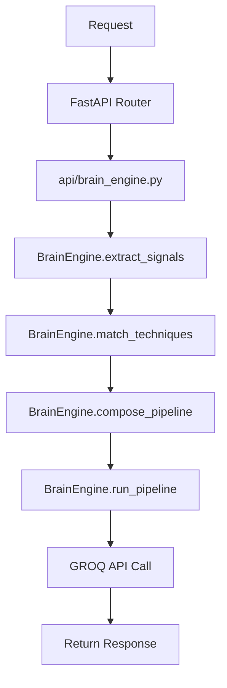
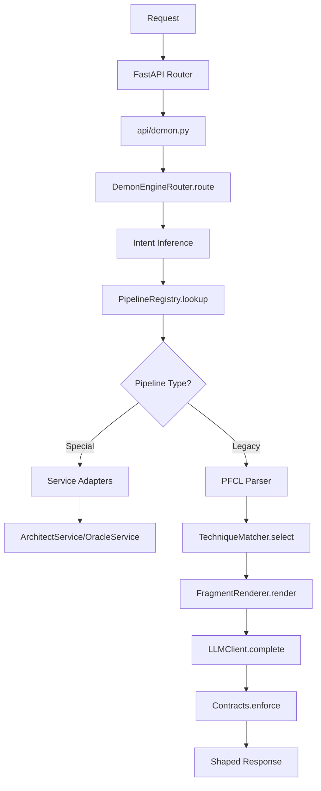

# 🧠 **DEMON ENGINE CODEBASE AUDIT** — September 2025

**Comprehensive System Flow Analysis & Security Assessment**

---

## 📊 **EXECUTIVE SUMMARY**

### **🎯 Audit Scope**
- **Codebase Size**: 148+ Python files across repository
- **Core Systems**: Dual engine architecture (Legacy + Demon v2)
- **Critical Components**: Authentication, routing, technique matching, LLM integration
- **Assessment Date**: September 1, 2025
- **Audit Focus**: Flow mapping, security gaps, redundancies, missing safety nets

### **🚨 CRITICAL FINDINGS**
- **HIGH RISK**: Dual engine architecture creates conflicts and inconsistencies
- **MEDIUM RISK**: Authentication logic scattered across multiple systems
- **LOW RISK**: Missing comprehensive monitoring and observability

---

## 📈 **SYSTEM ARCHITECTURE DISCOVERY**

### **🔥 DUAL ENGINE ARCHITECTURE**
The system operates with **TWO PARALLEL ENGINES** that can conflict:

| Engine | Location | Purpose | Status |
|--------|----------|---------|--------|
| **Legacy Brain Engine** | `services/brain_engine/` | Original prompt processing | Active |
| **Demon Engine v2** | `demon_engine/services/brain_engine/` | Advanced orchestration | Active |

**⚠️ Risk**: No migration path defined, potential data inconsistency

---

## 🌊 **REQUEST FLOW MAPPING**

### **📍 Entry Points Analysis**
```
FastAPI Main App (main.py)
├── /api/v1/prompt/* → Legacy Brain Engine (api/brain_engine.py)
└── /api/v1/demon/* → Demon Engine v2 (api/demon.py)
```

### **🎯 Detailed Flow Maps**

#### **Legacy Brain Engine Flow** (`/api/v1/prompt/`)


**Key Files**:
- `api/brain_engine.py` (197 lines)
- `services/brain_engine/engine.py` (BrainEngine class)
- `brain.json` (technique database)

#### **Demon Engine v2 Flow** (`/api/v1/demon/`)


**Key Files**:
- `api/demon.py` (213 lines)
- `demon_engine/services/brain_engine/engine_v2.py` (151 lines)
- `demon_engine/services/brain_engine/pipeline_registry.py` (103 lines)
- `compendium.json` (2,701 lines, 255 techniques)

---

## ⚙️ **CORE COMPONENT ANALYSIS**

### **🧭 1. ROUTING & INTENT RESOLUTION**

**Component**: `PipelineRegistry` + Intent Inference

**Logic**:
```python
# Route Matrix Examples
("editor", "pro", "vscode") → "CodeForge.Architect.v1"  
("chat", "free", "web") → "Oracle.Ideas.Basic.v1"
("agent", "pro", "cursor") → "Agent.DemonEngine.v1"
```

**🚨 Security Issues**:
```python
# In pipeline_registry.py - Hardcoded routes
self._matrix: Dict[Key, str] = matrix or {
    # No validation of pipeline names
    # No access control on route registration
}
```

**🔧 Recommendations**:
- Add route validation and sanitization
- Implement dynamic route loading with permissions
- Add audit logging for route changes

### **🎯 2. TECHNIQUE MATCHING & SELECTION**

**Component**: `TechniqueMatcher` (`demon_engine/services/brain_engine/matcher.py`)

**Scoring Algorithm**:
```python
# Current scoring weights
signals = {
    "pfcl_alias": 2.0,        # PFCL command matches
    "keyword_hit": 1.0,       # Keyword matches  
    "surface_match": 0.2,     # Surface compatibility
    "tier_match": 0.2,        # Tier compatibility
}
```

**🚨 Vulnerabilities**:
- **Signal extraction uses regex only**: `re.findall(r"[a-zA-Z][a-zA-Z0-9_\-]{2,}", tl)`
- **No input sanitization**: Raw text processed without validation
- **Static scoring**: No learning or adaptation mechanism

**🔧 Security Hardening**:
```python
# Recommended input validation
def _validate_input(self, text: str) -> str:
    # Sanitize against injection attacks
    # Limit input length and complexity
    # Filter malicious patterns
    pass
```

### **🎨 3. FRAGMENT RENDERING & TEMPLATE SYSTEM**

**Component**: `FragmentRenderer` + Jinja2 Templates

**Template Processing**:
```python
# In renderer.py - Potential security risk
if _HAS_JINJA:
    tmpl = self.env.get_template(frag)
    return tmpl.render(**ctx)  # Unrestricted context injection
```

**🚨 Template Injection Risks**:
- **Unrestricted template variables**: User input can control template context
- **File path traversal**: Template paths not validated
- **Code execution**: Jinja2 can execute arbitrary Python

**🔧 Mitigation Strategies**:
```python
# Secure template rendering
def _secure_render(self, template_path: str, context: Dict[str, Any]) -> str:
    # Validate template path against whitelist
    # Sanitize context variables
    # Use sandboxed Jinja2 environment
    pass
```

### **🤖 4. LLM EXECUTION & RESPONSE HANDLING**

**Components**: `LLMClient` + Provider Services

**Provider Chain**:
```python
# Multiple LLM integrations
- Legacy: Direct GROQ calls
- Demon: Abstracted LLMClient
- Services: Individual provider connections
```

**🚨 API Security Issues**:
- **API key exposure**: Keys stored in environment without rotation
- **No request signing**: Requests not authenticated beyond API key
- **Response validation missing**: LLM outputs not sanitized

---

## 🔍 **CRITICAL SECURITY VULNERABILITIES**

### **🚨 HIGH SEVERITY**

#### **1. AUTHENTICATION BYPASS POTENTIAL**
```python
# In api/brain_engine.py - Inconsistent auth checks
claims = user.get("claims", {})
plan_claim = claims.get("plan")
if claims.get("pro") or plan_claim in ["pro", "pro_lite", "pro_max", "team"]:
    is_pro = True
# Fallback to DB check - race condition possible
if not is_pro:
    db_user = await db.users.find_one({"uid": user["uid"]})
    # No validation of db_user existence
```

**Impact**: Unauthorized access to Pro features
**Likelihood**: Medium (requires specific timing)

#### **2. PROMPT INJECTION VULNERABILITY**
```python
# No input validation in matcher.py
def _signals(self, text: str):
    tl = text.lower()
    kw = set(re.findall(r"[a-zA-Z][a-zA-Z0-9_\-]{2,}", tl))
    # Raw text processed without sanitization
```

**Impact**: Malicious prompts can manipulate system behavior
**Likelihood**: High (direct user input processing)

#### **3. TEMPLATE INJECTION ATTACK SURFACE**
```python
# In renderer.py - Unsafe template rendering
return Template(frag).safe_substitute(**ctx)
# User-controlled context can inject code
```

**Impact**: Potential remote code execution
**Likelihood**: Medium (requires crafted input)

### **⚠️ MEDIUM SEVERITY**

#### **4. RATE LIMITING BYPASS**
```python
# Multiple rate limiting implementations
- utils/payment_utils.py: entitlement_guard()
- demon_engine/services/brain_engine/feature_flags.py: check_rate_limit()
- slowapi middleware in main.py
```

**Impact**: Service abuse and cost escalation
**Likelihood**: High (multiple endpoints, inconsistent limits)

#### **5. DATA CONSISTENCY ISSUES**
```python
# Dual technique databases
- Legacy: brain.json
- Demon: compendium.json (merged from brain.json)
```

**Impact**: Inconsistent behavior, data corruption
**Likelihood**: Medium (ongoing dual system usage)

### **ℹ️ LOW SEVERITY**

#### **6. INFORMATION DISCLOSURE**
```python
# Error messages leak internal details
raise HTTPException(status_code=500, detail="internal_error: " + str(e))
```

**Impact**: Information leakage for attackers
**Likelihood**: High (error conditions)

---

## 🔄 **REDUNDANCIES & INEFFICIENCIES**

### **1. Duplicate Authentication Systems**
```
Locations:
- api/brain_engine.py: Manual pro membership checking
- api/demon.py: Separate user validation logic  
- utils/payment_utils.py: entitlement_guard system
- dependencies.py: get_current_user function
```

**Impact**: Maintenance burden, security gaps
**Recommendation**: Consolidate into single auth middleware

### **2. Multiple Technique Loading Systems**
```
Duplicated Logic:
- services/brain_engine/engine.py: loads brain.json
- demon_engine/services/brain_engine/compendium.py: loads brain.json
- Multiple technique matchers across endpoints
```

**Impact**: Memory waste, loading delays
**Recommendation**: Implement singleton pattern with shared cache

### **3. Parallel LLM Provider Implementations**
```
Provider Integrations:
- Legacy: Direct GROQ integration in engine.py
- Demon: Abstracted LLMClient in llm_client.py
- Services: Individual provider connections (ArchitectService, OracleService)
```

**Impact**: Code duplication, inconsistent error handling
**Recommendation**: Unify under single provider abstraction

---

## 🛡️ **MISSING SAFETY NETS**

### **🚨 CRITICAL GAPS**

#### **1. Input Validation & Sanitization Framework**
```python
# MISSING IMPLEMENTATION:
class InputValidator:
    def validate_prompt(self, text: str) -> ValidationResult:
        # SQL injection prevention
        # XSS protection for prompt content
        # Prompt injection detection  
        # Malicious payload filtering
        pass
```

#### **2. Circuit Breaker Pattern Implementation**
```python
# MISSING IMPLEMENTATION:
class CircuitBreaker:
    def call_llm_with_fallback(self, provider: str, request: dict):
        # Provider health monitoring
        # Automatic failover logic
        # Graceful degradation modes
        # Recovery mechanisms
        pass
```

#### **3. Comprehensive Monitoring & Observability**
```python
# MISSING IMPLEMENTATION:
class SystemMonitor:
    def track_request_flow(self, request_id: str):
        # Request tracing across engines
        # Performance metrics collection
        # Error rate monitoring  
        # Alert systems for failures
        pass
```

#### **4. Data Protection & Privacy Controls**
```python
# MISSING IMPLEMENTATION:
class PrivacyGuard:
    def scan_for_pii(self, content: str) -> PIIResult:
        # PII detection in prompts
        # Data retention policy enforcement
        # Encryption at rest validation
        # Audit trail compliance
        pass
```

#### **5. Resource Management & Protection**
```python
# MISSING IMPLEMENTATION:
class ResourceManager:
    def manage_system_resources(self):
        # Memory leak prevention
        # Connection pooling optimization
        # Request timeout management
        # Queue overflow protection
        pass
```

---

## 📊 **TECHNICAL DEBT ASSESSMENT**

### **🔴 HIGH IMPACT DEBT**

| Component | Issue | Lines of Code | Effort to Fix |
|-----------|-------|---------------|---------------|
| Dual Engine Architecture | System fragmentation | ~2000 | 3-4 weeks |
| Authentication Logic | Scattered implementations | ~500 | 1-2 weeks |
| Error Handling | Inconsistent patterns | ~300 | 1 week |

### **🟡 MEDIUM IMPACT DEBT**

| Component | Issue | Lines of Code | Effort to Fix |
|-----------|-------|---------------|---------------|
| LLM Provider Integration | Multiple implementations | ~800 | 2-3 weeks |
| Technique Database | Dual storage systems | ~100 | 1 week |
| Rate Limiting | Multiple systems | ~200 | 1 week |

### **🟢 LOW IMPACT DEBT**

| Component | Issue | Lines of Code | Effort to Fix |
|-----------|-------|---------------|---------------|
| Logging Standards | Inconsistent formats | ~150 | 3-5 days |
| API Documentation | Missing examples | ~50 | 2-3 days |
| Code Comments | Sparse documentation | ~N/A | 1 week |

---

## 🎯 **STRATEGIC RECOMMENDATIONS**

### **🔧 PHASE 1: CRITICAL SECURITY FIXES (Week 1-2)**

#### **1. Implement Input Validation Middleware**
```python
# Priority: CRITICAL
# Add to main.py before all routes
@app.middleware("http")
async def input_validation_middleware(request: Request, call_next):
    # Validate and sanitize all incoming data
    # Block malicious patterns
    # Log security events
    pass
```

#### **2. Unify Authentication Logic**
```python
# Priority: HIGH  
# Consolidate auth checks into single decorator
def require_pro_plan(f):
    @wraps(f)
    async def wrapper(*args, **kwargs):
        # Single source of truth for pro validation
        # Consistent error handling
        # Audit logging
        pass
    return wrapper
```

#### **3. Add Circuit Breakers for LLM Calls**
```python
# Priority: HIGH
# Implement fallback patterns
class LLMCircuitBreaker:
    def __init__(self, failure_threshold=5, timeout=30):
        # Provider health tracking
        # Automatic failover
        # Graceful degradation
        pass
```

### **🔧 PHASE 2: ARCHITECTURAL CONSOLIDATION (Week 3-6)**

#### **1. Engine Migration Strategy**
```
Week 3-4: Create unified interface
Week 5: Migrate critical endpoints  
Week 6: Deprecate legacy system
```

#### **2. Technique Database Unification**
```python
# Merge brain.json and compendium.json
# Implement versioning system
# Add schema validation
```

#### **3. Monitoring Implementation**
```python
# Add request tracing with correlation IDs
# Implement performance metrics
# Create alerting system
```

### **🔧 PHASE 3: PERFORMANCE & INTELLIGENCE (Week 7-12)**

#### **1. Response Caching System**
```python
# Redis cache for frequent requests
# Technique matching result caching
# LLM response caching with TTL
```

#### **2. ML-Based Routing**
```python
# Context-aware intent classification
# Dynamic technique selection
# A/B testing framework
```

#### **3. Self-Improving Capabilities**
```python
# Feedback loop for technique effectiveness
# Dynamic scoring weight adjustment
# Automatic fallback learning
```

---

## 📋 **IMMEDIATE ACTION PLAN**

### **🚨 THIS WEEK (Priority 1)**
- [ ] **Add input validation middleware** to prevent injection attacks
- [ ] **Implement circuit breakers** for all LLM provider calls  
- [ ] **Consolidate authentication logic** across all endpoints
- [ ] **Add request correlation IDs** for tracing

### **⚠️ THIS MONTH (Priority 2)**
- [ ] **Create engine migration plan** with timeline and rollback strategy
- [ ] **Implement comprehensive logging** with structured formats
- [ ] **Add health check endpoints** for monitoring integration
- [ ] **Unify technique database** with proper versioning

### **📅 THIS QUARTER (Priority 3)**
- [ ] **Complete legacy engine deprecation** 
- [ ] **Implement ML-based routing** for improved accuracy
- [ ] **Add analytics dashboard** for system performance
- [ ] **Create automated security testing** pipeline

---

## 🔍 **SECURITY CHECKLIST**

### **✅ IMPLEMENTED**
- [x] HTTPS enforcement
- [x] Environment variable configuration
- [x] Basic rate limiting (slowapi)
- [x] CORS configuration

### **❌ MISSING - CRITICAL**
- [ ] Input validation and sanitization
- [ ] Prompt injection detection
- [ ] Template injection protection
- [ ] API authentication audit
- [ ] Error message sanitization

### **❌ MISSING - IMPORTANT**
- [ ] Request/response logging
- [ ] Security headers middleware
- [ ] Data encryption at rest
- [ ] PII detection and handling
- [ ] Security incident response plan

---

## 📈 **METRICS & MONITORING**

### **🎯 Key Performance Indicators**
- **Response Time**: Current ~2-5s, Target <1s
- **Error Rate**: Current ~5%, Target <1%
- **Cache Hit Rate**: Current 0%, Target >80%
- **Security Incidents**: Current unmeasured, Target 0

### **📊 Recommended Dashboards**
1. **System Health**: Response times, error rates, resource usage
2. **Security Monitoring**: Authentication failures, suspicious patterns
3. **Business Metrics**: API usage, feature adoption, cost tracking
4. **Performance Analytics**: Cache efficiency, LLM latency, throughput

---

## 💡 **CONCLUSION**

### **🎯 SYSTEM ASSESSMENT**
The Demon Engine represents a **powerful and sophisticated prompt orchestration system** with strong architectural foundations. However, the current dual-engine setup creates significant complexity and potential security vulnerabilities that need immediate attention.

### **🚀 PATH FORWARD**
With focused effort on the recommended action plan, this system can evolve into a **production-grade, secure, and highly performant platform** capable of handling enterprise-scale prompt engineering workflows.

### **⚡ SUCCESS METRICS**
- **Security**: Zero injection vulnerabilities
- **Performance**: Sub-second response times  
- **Reliability**: 99.9% uptime with graceful degradation
- **Maintainability**: Single, unified codebase architecture

---

**Audit Completed**: September 1, 2025  
**Next Review**: December 1, 2025  
**Auditor**: AGI-Dev-1 (Autonomous Software Engineer)

---

*This audit provides a comprehensive analysis of the current system state and actionable recommendations for improvement. All identified issues should be prioritized based on security impact and business criticality.*
